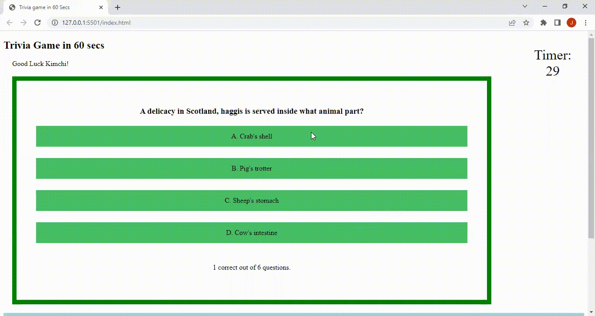

# Trivia Game in 60 sec
Trivia game in 60 sec is my first completed single page application project using vanilla Javascript only. Like the name implies, you will answer trivia questions in a 60 second time period. 



## Features
* db.json file where all the questions and answers are stored
* A form where your name can be submit to have a personal experience
* A start button to activate the timer so you won't be caught by surprise.
* Real-time response in which the correct answer will be highlighted in red after you have select your choice.
* Number of correct reponses will be tallying as you go along.
* In the end, you will have the option to be include on our "Top Scorers of All Time" scoring board. 

## Getting Started
To get started, JSON server needs to be install first:

```bash
$ npm install -g json-server
```

Next, the json-server needs to be run:

```bash
$ json-server --watch db.json
```
If you are able to see the notification that you accessing the server, you are ready to begin the trivia game. 


## Credits
Trivia Questions were taken from <https://travelswithelle.com/other/multiple-choice-trivia-questions/>. The questions were copied and reformated to be stored in the local json server.

